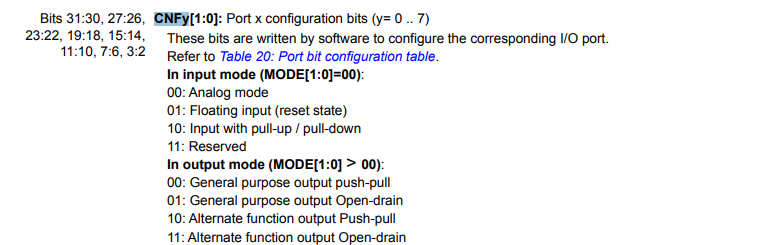

## Blink LED

enable CLK PORT C

    RCC_APB2ENR |= RCC_IOPCEN;

config OUTPUT PC13

	GPIOC->CRH.BITS.MODE_13 = 3;

Config I/O Port

	GPIOC->CRH.BITS.CNF_13 = 0;

Blink Led with ODR register

    GPIOC->ODR.REG = ~ GPIOC->ODR.REG; // register
    GPIOC->ODR.BITS.b13 = !GPIOC->ODR.BITS.b13; // bit

Blink Led with BSRR register

    GPIOC->BSRR.REG = (1UL << 13);
    delay_ms(100);
    GPIOC->BSRR.REG = (1UL << (13 + 16));
    delay_ms(100);

**Note:** Error when use BSRR.REG.BSR.b13 = 1 and BSRR.REG.BR.b13 = 1. I don't known what happened, but It's not work.I think the error occurs when writing to memory with unsigned short,and it writes with a word instead. I think this is the issue.