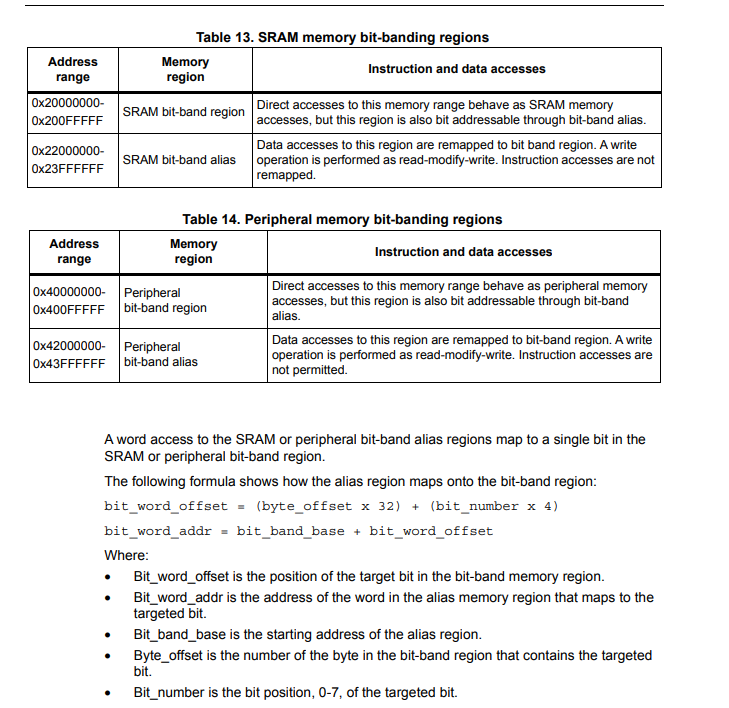

# 02 BitBand

## Introduction
In the previous lesson we encountered a problem with writing bit values in registers. Today I want to share with you how to write bit values to a register.

The image below describes the bit-band region and alias and formulates calculation of bit_word_offset and bit_word_addr.

In the my code:

 	uint8_t *alias_addr_PC13 = (uint8_t *)(0x42000000 + (32 * (0x40011010 - 0x40000000)) + 13 * 4);

 	uint8_t *alias_addr_PC13_1 = (uint8_t *)(0x42000000 + (32 * (0x40011010 - 0x40000000)) + (13+16) * 4);

I use the BSRR register:

- 0x40011010: This is address of BSRR. Now I want control bit 13 to set and bit (13+16) to reset PC13 GPIO.
- 0x40000000: This is address begin Peripheral bit-band region.
- 0x42000000: This is address begin Peripheral bit-band alias.
  
Similar with OBR register with address 0x4001100C.

    //  Use ODR register
    uint8_t *alias_addr_PC13 = (uint8_t *)(0x42000000 + (32 * (0x4001100C - 0x40000000)) + 13 * 4);
    *alias_addr_PC13 = 1;
    *alias_addr_PC13 = 0;

Why is bit_number defined as the position, 0-7 if the targeted bit but when i use 13*4 it still work well ? This is because I am working with a 32-bit register, so I can use bit 13 for this case.