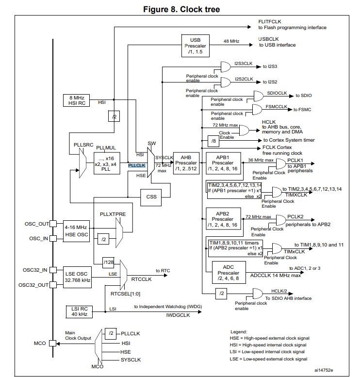
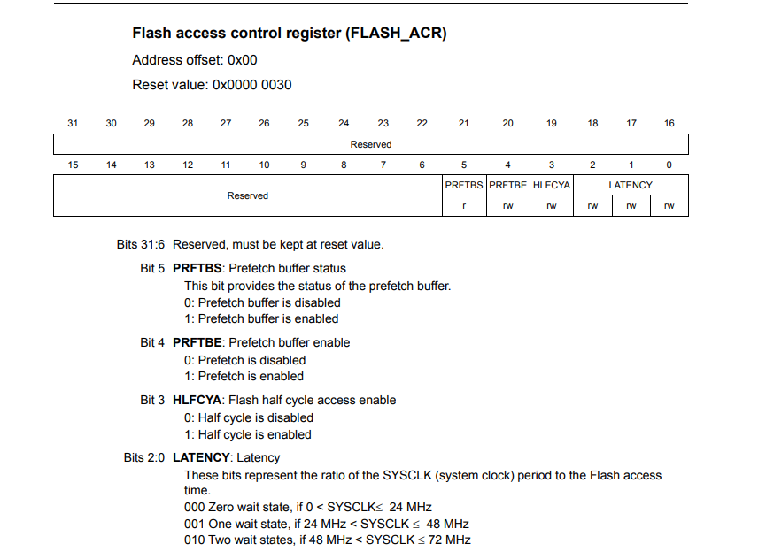
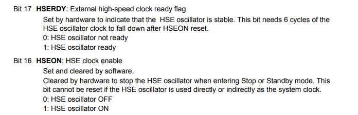
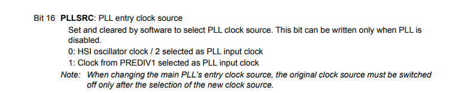
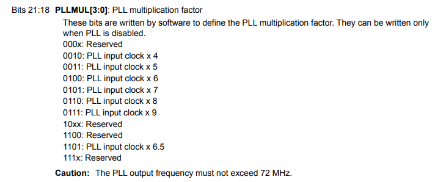
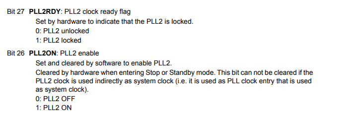
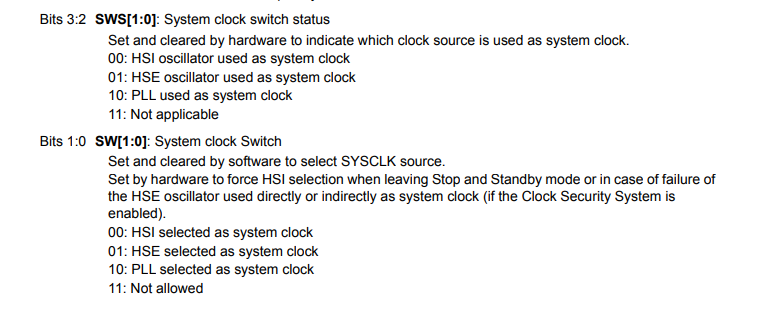
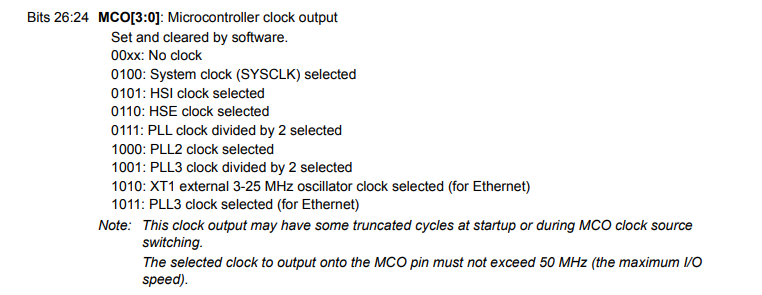
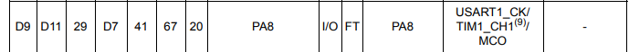

#  RCC 

There are 3 source clock:
- HSI (internal clock)
- PLLCLK from PLLMUL
- HSE (external clock)

The default clock is 8MHz from internal clock (HSI), the max value is 64 MHZ because it must  pass divisor by 2 and PLLMUL max 16 => 8/2x16 = 64 MHZ.

## Code

If we want to configure SYSCLK to be greater than 8MHZ internal we have to set the LATENCY value as shown in the image below.  

    FLASH->FLASH_ACR.REG |= 2;

Enable HSE oscillator and check ready flag.

	RCC->RCC_CR.REG |= 1 << 16;
	while(!RCC->RCC_CR.BITS.HSERDY);

	RCC->RCC_CFGR.REG |= 9 << 18; // X9 frequency
	RCC->RCC_CFGR.REG |= 1 << 16; // Use the external oscillator.

enable PLL and check flag ready.

	RCC->RCC_CR.REG |= 1 << 24;
	while(!RCC->RCC_CR.BITS.PLL_RDY);

Switch PLL selected as system clock

	RCC->RCC_CFGR.BITS.SW = 2;
	while(RCC->RCC_CFGR.BITS.SWS != 2);

    RCC->RCC_CFGR.REG = 4 << 24;

PIN PA8 is MOC pin- the output clock source.

