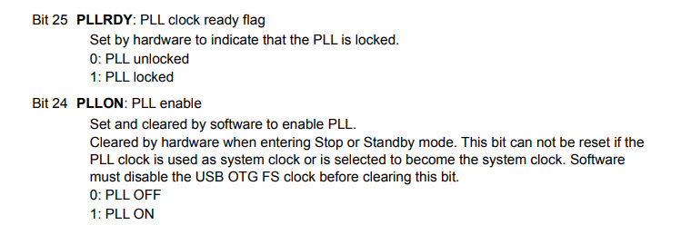

#  RCC 

There are 3 source clock:
- HSI (internal clock)
- PLLCLK from PLLMUL (Phase-Locked Loop Multiplier)
- HSE (external clock)

The default clock is 8MHz from internal clock (HSI), the max value is 64 MHZ because it must  pass divisor by 2 and PLLMUL max 16 => 8/2x16 = 64 MHZ.

LSE OSC: Why are 32.768 kHz crystals and oscillators used in realtime clocks. Because:
- Divides to 1 kHz – 32.768 (2^15) kHz crystals are easier to calculate clock signals with since they divide down to 1kHz, which is equivalent to one second in frequency. This is the basis for all day, date and time keeping functions for any electronic design.
- Low Power Consumption – 32.768 kHz crystals operate at low frequencies and consume less power than standard quartz crystals.
- Cost – While engineers are able to find many cost efficient solutions from cutting edge manufacturers, the low cost of 32.768 kHz crystals is still beneficial when they are included in designs. The low cost surely played a role in the growth in popularity of these crystals.

## Code

If we want to configure SYSCLK to be greater than 8MHZ internal we have to set the LATENCY value as shown in the image below.  

    FLASH->FLASH_ACR.REG |= 2;

Enable HSE oscillator and check ready flag.

	RCC->RCC_CR.REG |= 1 << 16;
	while(!RCC->RCC_CR.BITS.HSERDY);

	RCC->RCC_CFGR.REG |= 9 << 18; // X9 frequency
	RCC->RCC_CFGR.REG |= 1 << 16; // Use the external oscillator.

enable PLL and check flag ready.

	RCC->RCC_CR.REG |= 1 << 24;
	while(!RCC->RCC_CR.BITS.PLL_RDY);

Switch PLL selected as system clock

	RCC->RCC_CFGR.BITS.SW = 2;
	while(RCC->RCC_CFGR.BITS.SWS != 2);

    RCC->RCC_CFGR.REG = 4 << 24;

PIN PA8 is MOC pin- the output clock source.

