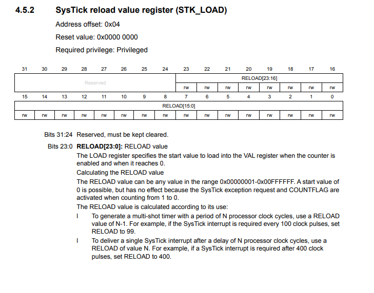

# 04 SysTick

	STK.VAL = 100; // write any value to reset counter
	STK.LOAD = 7999999; // 1s

frequency = (7999999 + 1)/8000000 = 1 s

STK.VAL: If you write any value to reset counter and clear the COUNTERFLAG

    STK.CTRL.REG |= (1 << 2) | (1 << 1) | 1;

