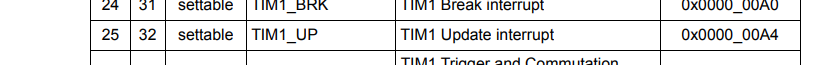

# Advanced Timer

## Interrupt
    GPIO_Mode(GPIOC, 13, GPIO_MODE_OUTPUT_OPEN_50MHz);
    TIM1->TIMx_CR2.REG  = 0;
    TIM1->TIMx_SMCR.REG = 0;
    TIM1->TIMx_DIER.REG = 1;
    TIM1->TIMx_ARR.REG  = 7999;
    TIM1->TIMx_CR1.REG |= 1 << 7 | 1 << 2 | 1;

    *((unsigned long *) 0xE000E100)  = 1 << 25; // enable NVIC

TIM1->TIMx_DIER.REG = 1; to enable interrupt.

TIM1->TIMx_ARR.REG  = 7999; to set auto-reload value.

## Register

	TIM1->TIMx_CCMR1.REG |= 6 << 4 ;
	TIM1->TIMx_BDTR.REG |= 1 << 15 | 1 << 10 | 1 << 11;

	TIM1->TIMx_CCER.REG |= 1;
	TIM1->TIMx_CCR1.REG = 1000;
	TIM1->TIMx_ARR.REG  = 7999;
	TIM1->TIMx_EGR.REG = 1;
	TIM1->TIMx_CR1.REG |= 1 << 7 | 1 << 2 | 1;
    
TIM1->TIMx_CCMR1.REG |= 6 << 4 ;

TIM1->TIMx_BDTR.REG |= 1 << 15 | 1 << 10 | 1 << 11;

TIM1->TIMx_CCER.REG |= 1;

TIM1->TIMx_CCR1.REG = 1000;

TIM1->TIMx_EGR.REG = 1;

