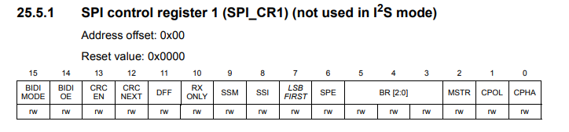
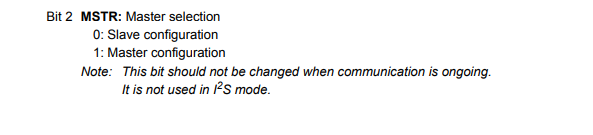
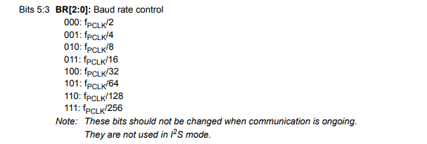
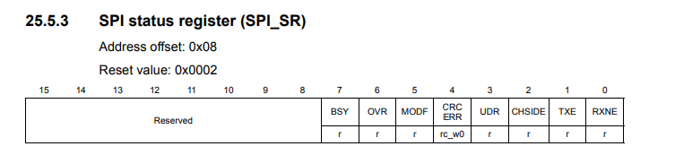
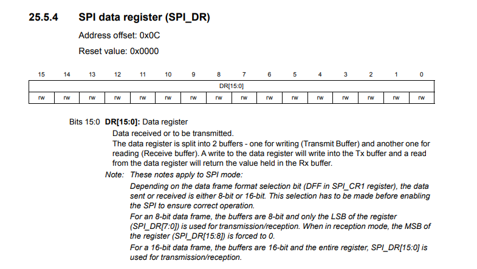
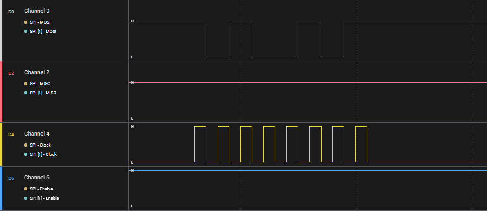
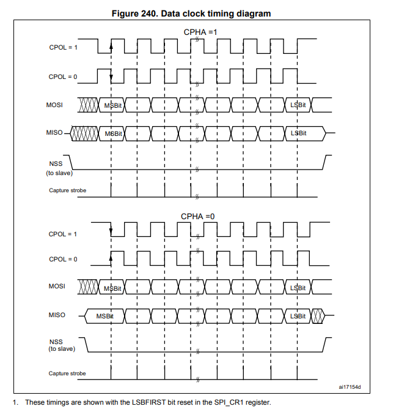

# SPI
This is SPI example of STM32

## explain code 

	GPIO_Mode(GPIOA,5,GPIO_MODE_AF_OUTPUT_PUSHPULL_50MHz);
	GPIO_Mode(GPIOA,6,GPIO_MODE_INPUT_FLOAT);
	GPIO_Mode(GPIOA,7,GPIO_MODE_AF_OUTPUT_PUSHPULL_50MHz);

Config MOSI and CLK with AF_OUTPUT_PUSHPULL 50 mhz mode
Config MISO with INPUT FLOAT mode

	SPI1->SPI_CR1.REG |= (1 << 2) | (3 << 3) ;
	SPI1->SPI_CR1.REG |= 1 << 6;

(1 << 2) to configuration Master mode.

(3 << 3) to configuration Baud rate control

Enable SPI

    void SPI1_Transmit(uint8_t data) {
        while (!(SPI1->SPI_SR.BITS.TXE));
        SPI1->SPI_DR.REG = data;
    }

    uint8_t SPI1_Receive(void) {
        while (!(SPI1->SPI_SR.BITS.RXNE));
        return SPI1->SPI_DR.REG;
    }

## The result

Reference Tables

